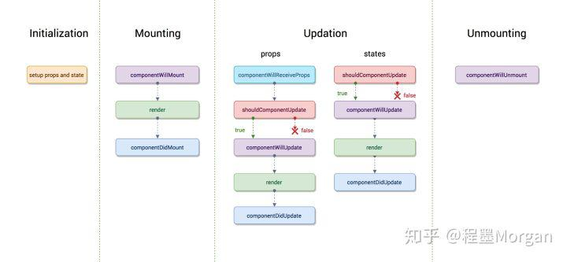
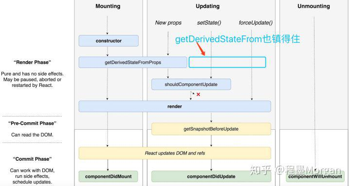

## React 16.0 - 16.7 主要更新 

### 0. 生命周期函数的更新

随着 React 16.0 发布, React 采用了新的内核架构 Fiber， 也由此引入了 static getDerivedStateFromProps 、 getSnapshotBeforeUpdate 及 componentDidCatch 等三个生命周期函数。同时，也将 componentWillUpdate、componentWillReceiveProps 和 componentWillUpdate 标记为不安全的方法。

旧生命周期

新生命周期

示例代码: 0.index

### 1. 全新的 Context API

示例代码: 1.index

### 2. React Strict Mode

示例代码: 2.index

###3. Portal

示例代码: 3.index

### 4. Refs

示例代码: 4.index

### 5. Fragment

示例代码: 5.index

### 6. lazy

示例代码: 6.index

### 7. React.memo

示例代码: 7.index

### 8. static contextType

示例代码: 8.index

### 9. static getDerivedStateFromError()

示例代码: 9.index

### 10. Hooks

示例代码: 10.index

